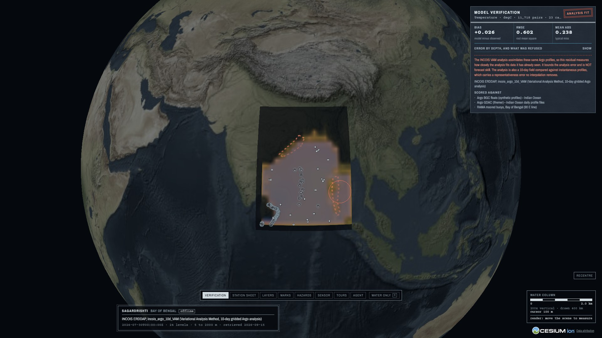
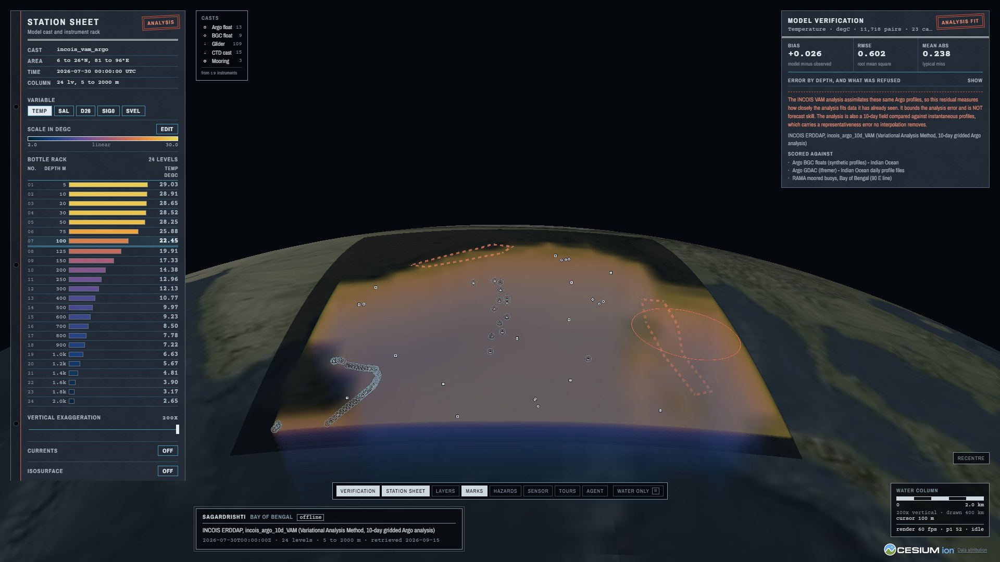
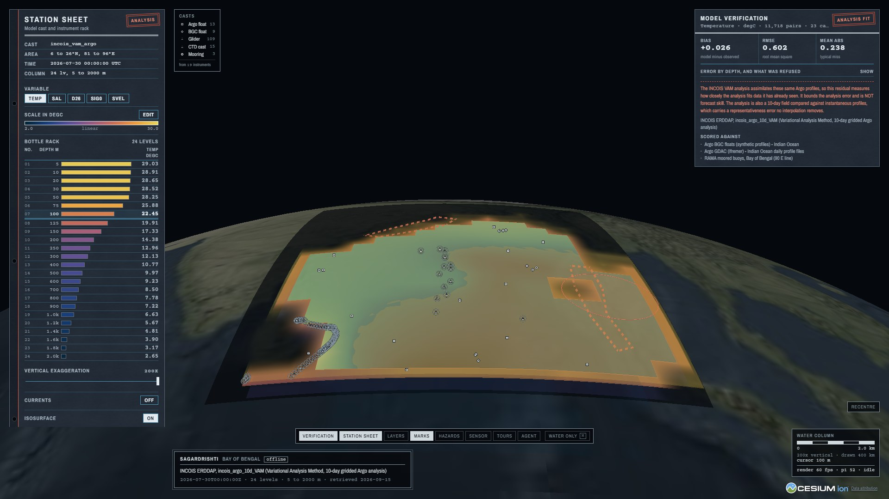
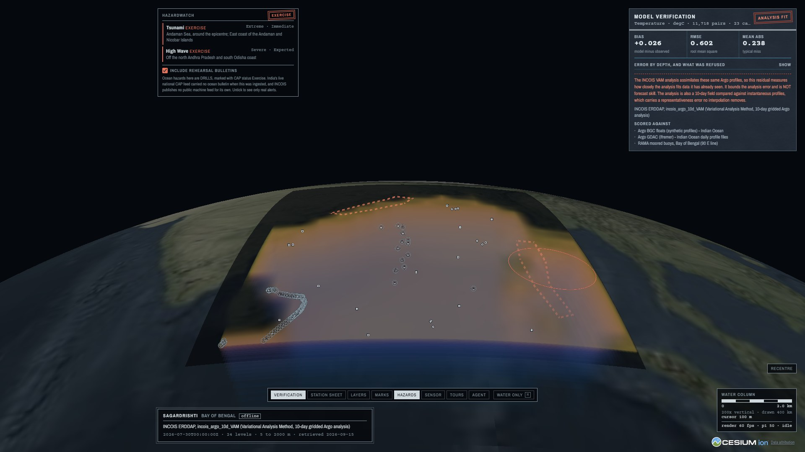
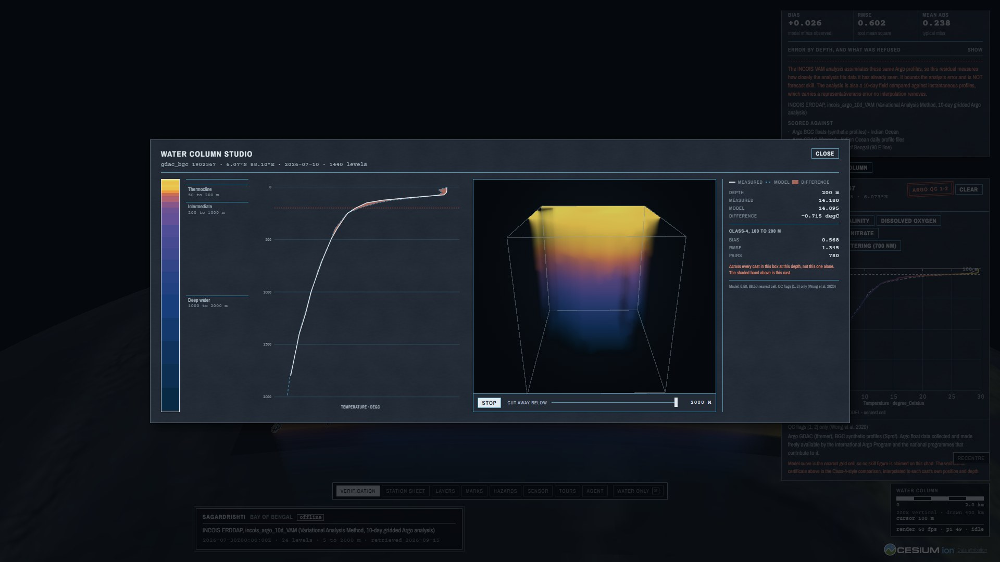
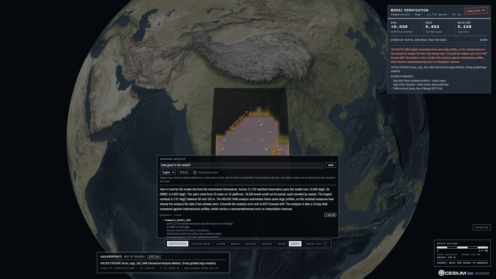
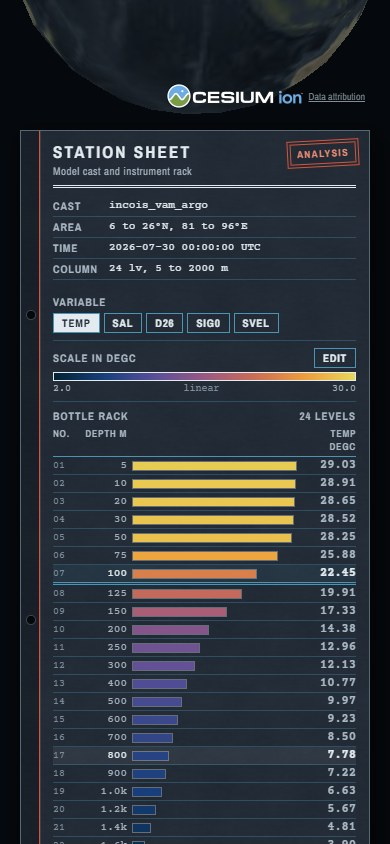

# SagarDrishti (सागर दृष्टि): a digital twin of the Indian Ocean

Browser-native 3D visualization of INCOIS ocean model fields fused with in-situ
observations, built for **Smart India Hackathon 2026, PS SIH26067**
(Ministry of Earth Sciences / INCOIS, theme: Disaster Management) by
**Team PixelPaws**.

**Demo video (3:49):** https://youtu.be/YbU09uJUCfE



## Screenshots

All taken from the running build (`tools/capture_readme_shots.mjs`), offline.

| | |
|---|---|
|  |  |
| **The water column.** 24 levels, 5 m to 2000 m, with the station sheet: variable, colorbar, the bottle rack of values by depth, vertical exaggeration. | **The 26 degC isosurface**, the depth of cyclone fuel, extracted from the grid by marching cubes. |
|  |  |
| **HazardWatch.** CAP v1.2 warnings over the water; rehearsal bulletins are marked EXERCISE and never pass for real alerts. | **The water column studio.** A BGC float's measured profile against the model, the GPU ray-marched volume, and the Class-4 numbers at the depth under the cursor. |
|  |  |
| **Samudra Sahayak.** An answer built only from tool results, with its working and its caveat. | **Phone width.** The same build; nothing to install. |

> INCOIS generates 3D ocean model output and in-situ observations daily, but
> forecasters must "toggle between disparate software packages" to see them
> together, which "impedes timely hazard assessment, search-and-rescue support,
> fishery advisories, climate monitoring." SagarDrishti puts the model field and
> every instrument in the water in one interactive 3D scene, in a browser, with
> no client install, and puts a number on the gap between them.

## What it does, against the problem statement

| PS requirement | Where it is |
|---|---|
| **3D volumetric rendering** (WebGL / Three.js or Cesium.js): depth slices, isosurfaces, time animation | `apps/web/components/OceanGlobe.tsx` (CesiumJS globe, 24 levels, 5 m to 2000 m), `VolumeCube.tsx` (GPU ray-marched volume, Three.js), `GET /isosurface` (marching cubes on the native grid) |
| **Instrument data overlay**: Argo, gliders, CTD, BGC, with depth-vs-variable profiles | `GET /profiles`, `ProfilePanel.tsx`: 149 casts from 19 instruments, QC flags 1 and 2 only (Wong et al. 2020) |
| **Multi-format ingestion**: NetCDF and delimited text, new sources without re-engineering | `services/api/app/` readers, `data/sources.yaml` registry: a new source is a config entry |
| **Colorbar and variable controls**: palette, range, log/linear, opacity, vertical exaggeration | the Station Sheet panel (`StationSheet.tsx`) |
| **Web-based, scalable architecture** | Next.js client, FastAPI data plane, a detachable agent service; `docker compose up`, tested with the full browser suite against the containers |
| **Extensible design**: future sensors and derived products | `services/api/plugins/`: a moored buoy, gliders and ship CTD casts are read by plugins; D26, sound speed and density (TEOS-10) are plugin-derived fields |
| **Open standards**: OGC WMS/WCS, CF Conventions | `GET /wms` (WMS 1.3.0), `GET /wcs` (WCS 1.0.0, CF-1.8 NetCDF). QGIS reads it |

And three things beyond the list:

- **Model-vs-observation scorecard.** Class-4-style verification in observation
  space (Ryan et al. 2015): the model is interpolated to each cast's own
  position and depth and scored there. Every level that cannot be matched
  honestly is refused and counted with its reason. It carries its own caveat:
  the analysis assimilates these same floats, so this is analysis fit, not
  forecast skill.
- **HazardWatch.** CAP v1.2 warnings parsed from India's national CAP backbone
  (NDMA SACHET), drawn over the water. Cancelled, expired and superseded alerts
  are refused, and a drill can never pass for a real warning.
- **Samudra Sahayak**, an agent that answers questions about the scene from the
  data plane's own tools only, cites its source, and can move the view.

## Quick start

A fresh clone has no data cube (it is gitignored), so build one first. From
the real INCOIS and Argo sample committed in `data/sample/`, with no network:

```bash
python tools/preprocess.py --fixtures
```

or pull the full sample from the live servers (the only network step):

```bash
python tools/fetch_sample.py && python tools/preprocess.py
```

Then, with Docker:

```bash
docker compose up --build        # then open http://localhost:3000
```

Three containers: `api` (port 8000), `agent` (8010) and `web` (3000). The data
directory is mounted read-only. An air-gapped variant runs the data plane with
no network at all:

```bash
docker compose -f docker-compose.yml -f docker-compose.offline.yml --profile airgap up api-airgap
```

Without Docker (Python 3.11, Node 22+, pnpm 10):

```bash
py -3.11 -m venv .venv
./.venv/Scripts/python.exe -m pip install -r services/api/requirements-dev.txt
pnpm install                     # postinstall vendors Cesium's assets

# the data cube, as above
./.venv/Scripts/python.exe tools/preprocess.py --fixtures

cd services/api && ../../.venv/Scripts/python.exe -m uvicorn app.main:app
pnpm web:dev
```

Windows shortcut: `./tasks.ps1 <setup|fetch|api|agent|web|test|demo|e2e|docker>`.

## Repository layout

```
apps/web/            Next.js 15 + CesiumJS client, Three.js volume
services/api/        FastAPI data plane: REST, OGC WMS/WCS, plugin registry
services/agent/      Samudra Sahayak agent plane, detachable by design
packages/scene/      SceneState schema shared by the UI, deep links and the agent
data/sources.yaml    the dataset registry, the extensibility surface
data/sample/         614 KB of real INCOIS field and Argo profiles, for CI
storyboards/         JSON guided tours
tools/               fetch, preprocess, offline cube build, RMSE validation
e2e/                 the demo path, in a real browser
```

## Two planes

The **data plane** (NetCDF and ASCII to xarray to chunked Zarr to FastAPI to
WebGL) is deterministic and meets every requirement above on its own. The
**agent plane** calls the same public API the browser calls and can change the
view only through a validated scene patch. Stop the agent and everything else
carries on; the ask box simply disappears.

## Offline first

`OFFLINE` defaults to `1`. The API reads only from the local Zarr and Parquet
cube, Cesium's assets are vendored (no ion token, no network), fonts are
self-hosted, and the whole demo runs with the network off. The browser suite
fails if a single request leaves the machine.

## API

Served by `services/api`; OpenAPI is at `/docs`.

| Route | What it is for |
|---|---|
| `GET /healthz` | Liveness, offline flag, which stores and plugins loaded |
| `GET /catalog` | Datasets materialized locally, with variables, depths, times and citation |
| `GET /field/{source}/{var}` | One slab by `bbox`, `time` and `depth` or `all_depths`; plugin-derived products too |
| `GET /profiles`, `GET /profiles/{id}` | Instrument positions for the globe; every accepted level of one profile with its QC policy and citation |
| `GET /isosurface/{source}/{var}` | The surface where a field takes a given value, as a triangle mesh, with refusal counts |
| `GET /scorecard/{source}/{var}` | Class-4-style verification: bias and RMSE per depth band, every unpaired level counted with its reason, and the caveat |
| `GET /warnings` | Active CAP v1.2 warnings at an instant, as polygons and circles, with every refusal counted |
| `GET /currents/{source}` | Current vectors at depth, block-averaged, with the stride and the refused coastal blocks stated |
| `GET /storyboards` | Guided tours; every numeral in a narration line must be backed by its evidence |
| `GET /wms` | OGC WMS 1.3.0: GetCapabilities and GetMap, time and elevation dimensions |
| `GET /wcs` | OGC WCS 1.0.0: GetCapabilities, DescribeCoverage, GetCoverage as CF-1.8 NetCDF |
| `GET /plugins`, `POST /plugins/reload` | Registered plugins and their products; re-scan without a restart |

Open the WMS layer in QGIS:

```
http://127.0.0.1:8000/wms?service=WMS&version=1.3.0&request=GetCapabilities
```

### The agent, on port 8010

| Route | What it is for |
|---|---|
| `GET /healthz` | Liveness, whether the data plane is reachable, and whether a language model is loaded |
| `GET /tools` | The tool schemas and the no-fabrication rule |
| `POST /ask` | A question, answered from tool results only, with the full tool trace and citations |
| `GET /voice/status`, `POST /voice/asr`, `POST /voice/speak` | Speech in Hindi, Telugu, Tamil and English through Bhashini, called from this server only, so no key reaches a browser |

Two properties are enforced by code, not promised:

- **Numbers enter answers only through tools.** `app/guard.py` checks every
  numeral in a finished answer against the tool results and withholds an answer
  that fails.
- **The agent cannot draw.** Its only channel to the view is a validated scene
  patch, applied through the same store a person's clicks go through.

The planner today is deterministic rules, not a language model, and every
answer says so (`planner: rules`). With `OFFLINE=1` voice is off and says so in
the panel; English answers can still be read aloud by the computer's own voice.
A translated answer is shown beside the English one, labelled as machine
translation; the English is the one the numbers are checked against.

## Tests

```bash
./tasks.ps1 test     # 512 data-plane tests
python -m pytest services/agent/tests    # 96 agent, guard and voice tests
./tasks.ps1 e2e      # 12 browser tests against a production build
./tasks.ps1 docker   # the same 12, against the three containers
```

All run with no network. CI builds its cube from `data/sample/`, real INCOIS
field and Argo profiles committed for the purpose, because the browser suite
asserts claims about the real Bay of Bengal.

The data plane is developed test first ([CONTRIBUTING.md](CONTRIBUTING.md)).
The suite pins the CF edge cases real government NetCDF exhibits: three
different `_FillValue` conventions observed in live files, `scale_factor` and
`add_offset` applied exactly once, a vertical coordinate with no `positive`
attribute, non-CF unit strings, and Argo QC-flag filtering per parameter.

## Data sources

Registered in [`data/sources.yaml`](data/sources.yaml); adding a delimited-text
layout or a BGC parameter is a config entry rather than a code change.

| Source | Kind | State |
|---|---|---|
| `incois_vam_argo` | erddap_griddap | live, the primary field: INCOIS 10-day gridded Argo analysis |
| `argo_gdac_indian` | gdac_geo | live, core Argo floats in the demo box |
| `argo_bgc_indian` | gdac_bgc | live, BGC floats: oxygen, chlorophyll, nitrate, pH |
| `rama_mooring_bob` | mooring | live, read by a plugin. RAMA moored buoy 15N 90E (WMO 23009) |
| `cmems_glider_bob` | insitu_tac | live, read by a plugin. Glider ru29 (WMO 2801900), 2018, marked archive |
| `cmems_ctd_bob` | insitu_tac | live, same plugin. Shipboard CTD casts, 1990 to 1991, marked archive |
| `glorys12_cur` | copernicus | live, depth-resolved currents: Copernicus Marine global 1/12 degree analysis (`cmems_mod_glo_phy-cur_anfc_0.083deg_P1D-m`) |
| `cap_sachet_india` | cap | live, India's national CAP v1.2 feed (NDMA SACHET) |
| `cap_incois_ocean` | cap | ocean-hazard CAP bulletins (tsunami, high wave, swell surge); rehearsal bulletins are marked as drills |
| `incois_oceansat2_chl` | erddap_griddap | registered and disabled: the series ends in 2020, so it cannot share a 2026 time scrubber |
| `ctd_text_ascii`, `odv_spreadsheet` | file | readers live and tested |
| `local_cube` | zarr | the `OFFLINE=1` target |

## Licence and attribution

Built entirely on open-source components. Data remains the property of its
providers (INCOIS, Argo GDAC, Copernicus Marine, NOAA PMEL, NDMA SACHET), every
derived product carries a `provenance.json`, and the agent cites dataset,
timestamp and platform ID for every number it states.
