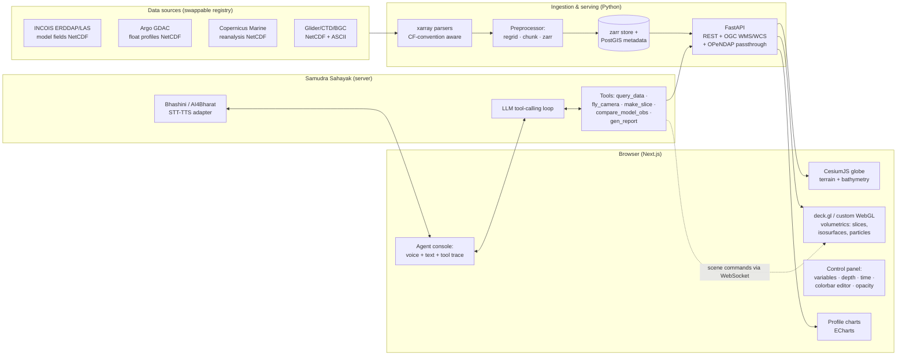

# TRD — SagarDrishti: Technical Requirements & Architecture

**Companion to:** PRD.md · **PS:** SIH26067 (MoES/INCOIS, theme: Disaster Management) · **Status:** pre-build design, v1.1 (Sep 7: prior-art methodology adoptions + M8 HazardWatch + M9 SagarNode; see PRIOR-ART.md)

---

## 1. Architecture overview



**Two planes, cleanly separated:**
- **Data plane** (deterministic): NetCDF/ASCII → xarray → chunked zarr → FastAPI → WebGL. Works fully without the agent.
- **Agent plane** (orchestration): the LLM never computes numbers — it calls the same public API the UI uses, plus scene-control commands over WebSocket. Kill the agent and the product still satisfies every P0 requirement. This isolation is our mid-finale pivot insurance.

## 2. Stack (with rationale)

| Layer | Choice | Rationale |
|---|---|---|
| Frontend framework | **Next.js 15 + TypeScript** | Lead's proven stack; static-export friendly for offline mode |
| Globe | **CesiumJS** | PS names it; geodetic accuracy, built-in terrain, time-dynamic primitives |
| Volumetrics | **deck.gl custom layers + raw WebGL2 shaders** (three.js fallback) | Cesium alone can't do volume slicing/isosurfaces well; deck.gl interleaves with Cesium; marching-cubes isosurfaces precomputed server-side (Python `scikit-image`) when GPU budget is tight |
| Charts | **Apache ECharts** | Profile plots (depth-vs-variable), RMSE scorecards; canvas perf |
| State | Zustand + a single serializable `SceneState` object | Deep-linkable scenes; the agent mutates the same state object the UI does |
| Backend | **FastAPI (Python 3.12)** | PS suggests REST/OPeNDAP; xarray ecosystem is Python |
| Data engine | **xarray + dask + zarr; netCDF4/cf-xarray** | CF-convention parsing as the PS demands; lazy chunked reads |
| Metadata/catalog | **PostGIS** (SQLite+Spatialite in offline mode) | Instrument positions, dataset registry, scene bookmarks |
| OGC endpoints | FastAPI WMS/WCS shim over zarr (GetMap/GetCoverage), OPeNDAP passthrough to source ERDDAPs | PS requires OGC WMS/WCS interoperability |
| Agent | **LLM with native tool-calling** (Gemini/GPT/Claude API online; **Ollama + open-weight model offline**), thin custom loop — no heavy framework | Custom loop = debuggable at 3 a.m. in the finale; provider-agnostic adapter (pivot insurance) |
| Voice | **Bhashini API** (online) / AI4Bharat IndicConformer STT + IndicTTS (offline, ONNX) | Government's own language stack = judging points; offline fallback keeps F11 honest |
| Reports | WeasyPrint (HTML→PDF) with dataset citations | F8 deliverable |
| Packaging | Docker Compose (api, agent, web, db); single `docker compose up` | "Deployable on INCOIS infrastructure" |

## 3. Data source catalog (verified reachable 24 Aug 2026; ★ = officially specified in the PS's dataset links, added by INCOIS post-launch — build the primary path on these)

| Source | URL | Content | Access |
|---|---|---|---|
| ★ INCOIS LAS | https://las.incois.gov.in | Model fields (T/S/currents/chl) — **PS-specified model source** | Open |
| ★ Copernicus GLORYS12 | https://data.marine.copernicus.eu/product/GLOBAL_MULTIYEAR_PHY_001_030/description | **PS-specified** reanalysis product (T/S/U/V, 50 depth levels) | Free login, `copernicusmarine` client |
| ★ Argo GDAC (Ifremer) | ftp://ftp.ifremer.fr/ifremer/argo (HTTPS mirror: https://data-argo.ifremer.fr) | **PS-specified** Argo float profiles (NetCDF) | Open FTP/HTTPS |
| ★ Glider GDAC (Ifremer) | ftp://ftp.ifremer.fr/ifremer/glider/v2/ | **PS-specified** glider profiles | Open FTP |
| INCOIS ERDDAP | https://erddap.incois.gov.in/erddap/index.html | Indian-ocean model outputs, obs datasets | Open, REST/OPeNDAP |
| Argovis API | https://argovis.colorado.edu | Argo profiles as JSON (fast dev path; mirror its colocation API semantics per PRIOR-ART §E) | Open REST |
| NOAA NCEI ERDDAP | https://www.ncei.noaa.gov/erddap/index.html | Backup obs datasets | Open |
| MOSDAC / Bhuvan (optional) | mosdac.gov.in / bhuvan.nrsc.gov.in | Satellite SST/chl overlays; cyclone tracks | Open/registered |
| IMD cyclone best tracks (scenarios) | rsmcnewdelhi.imd.gov.in | Cyclone track archive for storyboards | Open |

**Offline demo cube:** Bay of Bengal + Arabian Sea, 1 month around one cyclone (e.g. Mocha '23 or a 2026 event): model T/S/U/V/chl at ~25 depth levels + all Argo profiles in the box + cyclone track → rechunked zarr, ~2–4 GB, shipped with the laptop. Build script `tools/build_offline_cube.py`.

## 4. Module specs

### M1 — Ingestion & registry (owner: 70% dev)
- `sources.yaml` registry: `{id, kind: erddap|gdac|copernicus|file, url, variables[], depth_dim, time_dim, cf_overrides}`. **Adding a variable/source = editing this file** (F3/F6; live-demo-able).
- xarray loader per kind; CF-convention normalization (cf-xarray); unit harmonization; ASCII/CSV profile parser for glider/CTD text formats.
- Preprocessor CLI: subset → regrid (xesmf/pyresample) → rechunk → zarr; provenance JSON per dataset (feeds agent citations).
- Interface: `Catalog.list() / get(id) / slice(id, var, bbox, depth, t)` returning xarray objects.

### M2 — API (owner: 70% dev, lead reviews)
- REST: `/catalog`, `/field/{id}/{var}?bbox&depth&time&res` (binary Float32 tiles + JSON header), `/isosurface/{id}/{var}?value&time` (precomputed mesh, Draco-compressed), `/profiles?bbox&time&platform`, `/compare?field&platform_id&time` (per-depth model minus obs + RMSE/bias), `/report` (POST scene state → PDF).
- OGC: `/wms` GetCapabilities/GetMap (PNG tiles via matplotlib colormaps server-side), `/wcs` GetCoverage (NetCDF subset out) — thin but standards-true (F7).
- WebSocket `/scene`: broadcast `SceneCommand` objects (see M4) to the client.

### M3 — 3D engine (owner: lead)
- Cesium globe with GEBCO bathymetry terrain (offline: pre-tiled).
- Volume rendering strategy (perf-budgeted, in order): (a) stacked depth-slice textures with opacity transfer function — cheap, always works; (b) server-precomputed isosurface meshes (marching cubes) streamed as glTF; (c) GPU ray-marched volume in a custom deck.gl layer — **with early ray termination + adaptive step size** (Yu et al. 2025, PRIOR-ART §E), WebGPU where available / WebGL2 fallback — only where FPS ≥ 45 on the demo laptop.
- **Two-tier rendering rule** (Liu et al. 2019): raw volume only for the scalar being actively inspected; eddies/fronts extracted server-side and streamed as light geometry.
- Current vectors: GPU particle advection (like earth.nullschool but depth-resolved; seed density adaptive).
- Argo/Glider entities: Cesium point primitives with time-dynamic positions; click → ECharts profile panel; glider tracks as depth-colored polylines.
- Controls (F4): variable selector, depth slider + numeric input, time scrubber with play/loop, colorbar editor (palette from crameri/cmocean sets, min/max, log/linear), opacity per layer, vertical-exaggeration slider (1×–200×).
- `SceneState` (serializable): `{camera, layers[], variable, depthRange, time, colorbar, exaggeration, selection}` — single source of truth for UI, deep links, and the agent.

### M4 — Samudra Sahayak agent (owner: lead)
- Tool schema (all deterministic, all auditable):
  - `search_catalog(query)` → dataset ids
  - `get_field_summary(id, var, bbox, time)` → stats (min/max/mean, thermocline depth via gradient max)
  - `compare_model_obs(field_id, platform_id, time)` → RMSE/bias table
  - `set_scene(scene_patch)` → validated `SceneCommand` to WebSocket (camera flight, layer/variable/depth/time/colorbar changes)
  - `run_storyboard(id)` · `generate_report(scene_state, findings)` → PDF path
- Loop: plan → tool call(s) → observe → answer; hard cap 8 tool calls; every answer lists datasets/floats used (citations from provenance JSON). Tool-trace panel streams to the UI (judges watch it think).
- Voice: push-to-talk → Bhashini STT (or local IndicConformer ONNX) → agent → TTS reply; language auto-detect for hi/te/ta/en.
- Guardrails: agent cannot fabricate numeric values — numbers only enter answers via tool results; out-of-scope questions → polite refusal listing capabilities (judges test this).

### M5 — Comparison & scorecard (owner: 50% dev)
- **Methodology = GODAE OceanView "Class 4"** (Ryan et al. 2015, see PRIOR-ART.md): verify in *observation space* — interpolate the model to each Argo profile's (lat, lon, depth, time); per-depth-bin bias/RMSE/correlation per region/variable. Use **QC flags 1/2 only** (Wong et al. 2020). Label the panel "Class-4-style verification" — domain-literate signal to MoES judges.
- Scorecard UI: heatmap (depth × time) of residuals + headline metrics; export CSV.
- Validation fixture: reproduce a published GLORYS-vs-Argo comparison number within tolerance → cite in slides (evidence culture wins).

### M6 — Offline mode (owner: lead + 70% dev, day-1 CI concern)
- `OFFLINE=1` swaps: sources → local zarr cube; LLM → Ollama local model; STT/TTS → ONNX local; Cesium assets/terrain/tiles → local static; PostGIS → SQLite. CI job boots the full stack with network disabled and runs a Playwright script through the demo path.

### M7 — Storyboards & outreach mode (owners: beginners ×3, lead reviews)
- JSON-scripted tours: sequence of `SceneCommand`s + narration text + optional TTS audio; pause/resume; "classroom mode" with simplified UI.
- Content: (1) cyclone cold-wake, (2) monsoon upwelling off Kerala, (3) an eddy seen by a glider, (4) "what is an Argo float?" explainer.

### M8 — HazardWatch warning layer (owner: 50% dev + lead reviews; PRD F13)
- **Ingest:** INCOIS multi-hazard advisories (tsunami/high-wave/swell-surge from tsunami.incois.gov.in + OSF bulletins). Where a machine feed isn't public, ship curated **CAP v1.2 XML samples** modeled on ITEWC bulletin structure (RTSP User Guide) and say so honestly; parser handles real CAP if/when a feed is available.
- **Model:** CAP fields → `{event, severity, urgency, certainty, area polygon, effective/expires}` → PostGIS table → `/warnings` REST + WebSocket push.
- **Render:** Cesium polygon entities, severity→color ramp (CAP semantics), pulsing border for `urgency=Immediate`; active-warnings banner; click → CAP detail card.
- **Alert bus:** one internal event stream consumed by (a) the banner, (b) the agent (narrates + offers camera fly-to), (c) SagarNode threshold trips (M9) which *publish* onto the same bus as locally-generated CAP-shaped alerts (flagged `source: demo-sensor`).
- Grounding for slides/judges: INCOIS = UNESCO-IOC Tsunami Service Provider; NDMA SACHET = India's national CAP backbone (PRIOR-ART.md §D refs).

### M9 — SagarNode live sensor ingest (owners: beginners 2–3 + 50% dev; PRD "SagarNode" section)
- **Firmware (`firmware/sagarnode/`):** ESP32 Arduino sketch — DS18B20 on 1-Wire GPIO4 (4.7 kΩ pull-up), TDS on ADC1_CH0, turbidity on ADC1_CH3; 1 Hz sampling, 10-sample median filter; publishes JSON `{station_id, ts, temp_c, tds_ppm, turbidity_ntu}` via **MQTT** (topic `sagardrishti/station/{id}/telemetry`, QoS 1) with **HTTP POST fallback** (`/ingest/sagarnode`) — campus WiFi often blocks port 8883.
- **Bridge:** FastAPI subscriber → append to time-series store → WebSocket to client → live "virtual mooring" glyph on the globe (configured lat/lon) with trend sparkline; registered in `sources.yaml` as `kind: mqtt` — **this is PS requirement F6 ("future sensor integration") demonstrated live**.
- **Thresholds:** rolling z-score on ΔT and turbidity; trip → CAP-shaped alert onto the M8 bus (`source: demo-sensor`, explicitly labeled a pedagogical stand-in).
- **Safety/wording:** USB low-voltage only, probes in water/electronics outside; call TDS a "conductivity-derived salinity proxy," never a salinity sensor.
- BOM ≈ ₹1,650–3,000 (PRIOR-ART.md §F, verified Indian retail).

## 5. Performance budgets

- First meaningful render (offline cube): **<3 s**; scene FPS: **≥60 target / 30 floor** at 1080p on integrated GPU (RTX-class demo laptop: comfortably above).
- Field tile response: <300 ms (precomputed chunks); isosurface mesh: <1 s (precomputed per timestep at 3 iso-values).
- Agent: first token <2 s online; complete scene action <10 s; voice round-trip <5 s.
- Memory: browser heap <1.5 GB with 4 layers active (chunk eviction by LRU).

## 6. Pivot insurance (mid-finale requirement changes are expected)

1. New variable/region/source → `sources.yaml` entry + preprocessor run (rehearse the drill: <30 min).
2. LLM provider ban/outage → provider adapter: swap Gemini↔GPT↔Claude↔Ollama by env var.
3. "Show it on our data" → OPeNDAP passthrough mode reads any CF-compliant ERDDAP URL live.
4. 3D perf disaster on unknown hardware → strategy (a) slices-only mode is one flag; still satisfies F1 minimum.
5. Judge dislikes agent → agent plane detaches; product stands alone on P0.

## 7. Grand-finale 36-hour build plan (roles per TEAM-ROLES.md)

**Pre-finale (allowed & expected):** architecture, offline cube, storyboards, rehearsed demo. Finale = assemble, harden, respond to judges.

| Hours | Focus |
|---|---|
| 0–4 | Env up (compose), offline cube verified, smoke demo #1 recorded as fallback video |
| 4–12 | P0 hardening: controls polish, profile charts, WMS endpoint check; mentoring round 1 notes → task board |
| 12–20 | Agent scenarios ×5 rehearsed; scorecard validation; storyboard narration recording; round-2 changes shipped |
| 20–28 | Judge-requested pivots (reserved capacity — do not plan features here); perf pass; accessibility pass (keyboard, contrast) |
| 28–33 | Full dress rehearsals ×3 with timer; every member speaks their section; failure drills (kill WiFi, kill agent) |
| 33–34 | **CODE FREEZE (T-2h, winner-verified practice)**; only content/config after |
| 34–36 | Backup video staged, laptop + spare both tested, power round |

## 8. Repo layout (for the new repo/agent)

```
sagardrishti/
  apps/web/            # Next.js + Cesium/deck.gl client
  services/api/        # FastAPI: REST + OGC + WebSocket
  services/agent/      # Samudra Sahayak loop, tools, voice adapters
  packages/scene/      # SceneState/SceneCommand schema (shared TS/Py via JSON Schema)
  data/sources.yaml    # dataset registry (THE extensibility surface)
  firmware/sagarnode/  # ESP32 sketch + wiring diagram (M9)
  tools/               # build_offline_cube.py, preprocess.py, validate_rmse.py
  storyboards/         # JSON tours + narration
  docs/                # this pack + PRIOR-ART.md + ADRs
  docker-compose.yml   # api+agent+web+db(+mqtt broker), OFFLINE=1 variant
```

## 9. Testing & verification

- Unit: parsers (CF edge cases: scale_factor, _FillValue, depth-positive-down), colocation math, colorbar mapping.
- Integration: Playwright demo-path script (the exact 10-min demo) in CI, online and OFFLINE=1.
- Data validation: `validate_rmse.py` against a published reference comparison.
- Perf: Lighthouse + custom FPS probe on the demo laptop profile, tracked per commit.
- Agent evals: 20 scripted judge-style questions (incl. adversarial/out-of-scope) with expected tool traces; regression-run before each round.

---
*Every P0 spec item traces to a sentence in the SIH26067 description (quoted in PRD §2/§5). Data-source URLs verified live 24 Aug 2026; PS-official dataset links (★) read from the live PS on 7 Sep 2026. Methodology adoptions from the prior-art review: PRIOR-ART.md §E.*
